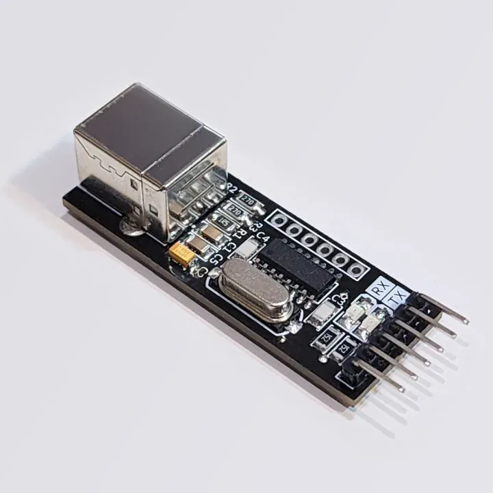

# 🔌 USB-to-Serial CH340G 

A simple and compact **USB-to-Serial breakout board** based on the **CH340G** chip.  This repository contains the design files (`SchDoc`, `PcbDoc`, `PrjPCB`) for a minimal module that is pin-compatible for programming boards like the **Arduino Pro Mini** — and breaks out all essential signal pins, including those often missing from typical Chinese clones.

Designed as an alternative to typical Chinese modules, this version exposes all essential signal lines like `DTR`, and adds user-friendly improvements like LEDs and better header layout.

I created this board because I was dissatisfied with the quality and design of off-the-shelf modules — especially those that didn't break out essential pins like **DTR**, which is required for automatic programming/flashing.

* Many modules **omit DTR**, making Arduino programming frustrating  
* They are often poorly assembled or unreliable  
  
  So I built my own — and now it's open-source for anyone to use, improve, and build on!

### 🛠️ Project Goals

-  **Complete signal access** (including `DTR`, `RTS`, and more)
-  **Compatible pin headers** with Arduino-style boards
-  **SMD design** for a compact profile (except USB and pin headers)
-  **LED indicators** for RX/TX
-  **Configurable power input** via current-limiting resistor
-  **Open-source hardware** ❤️

> [!WARNING]  
> **Voltage Support:**
> This board currently supports **5V only**.  
> ⚠️ Do **not** use it with 3.3V-only targets without level shifting!

## 📦 Project Contents

This repository contains:

* 🧩 `*.PrjPCB` – Altium Designer project file
* 📐 `*.SchDoc` – Schematic design
* 🛠️ `*.PcbDoc` – PCB layout

All files are provided in **Altium Designer** format.

## 🧰 Features

- ✅ CH340G-based USB-to-Serial adapter
- ✅ Fully exposed signal pins, including `DTR` and `CTS`
- ✅ RX/TX activity LEDs 🔴🔵
- ✅ USB Type-B connector for sturdy cable connections
- ✅ All components SMD (except USB and pin headers)
- ✅ Used **1206** components for ease of assembly by hand
- ✅ Default 5V operation
- ✅ Standard pin headers compatible with Arduino Pro Mini

## 📌 Pinout

Pin compatibility was a major and important usability requirement — especially for Arduino users.

### Primary Header (Main Serial Interface)

| Pin | Signal |
| --- | ------ |
| 1   | GND    |
| 2   | CTS    |
| 3   | VCC    |
| 4   | TXD    |
| 5   | RXD    |
| 6   | DTR    |

### Secondary Header (Optional Control Signals)

| Pin | Signal |
| --- | ------ |
| 1   | RTS    |
| 2   | DTR    |
| 3   | DCD    |
| 4   | RI     |
| 5   | DSR    |
| 6   | CTS    |

> [!NOTE]  
> Most **Arduino boards** only require the **Primary Header**.
> For Arduino Pro Mini:
> - **GND** → GND (always connect GND first)
> - **VCC** → VCC (5V only, see notes)
> - **TXD** ↔ **RX** (crossed)
> - **RXD** ↔ **TX** (crossed)
> - **DTR** → DTR (for auto-reset/programming)
>
> Optionally, connect **CTS** if your target requires it, for example on NodeMCU-based boards such as **ESP8266**, or **ESP32**.

> [!WARNING]  
> **Always connect the GND pin (ground common reference) first!**

> [!TIP]  
> 🔁 TX and RX are **crossed** when connecting to microcontrollers.
>
> * **TXD (this board)** ➜ **RX (target)**
> * **RXD (this board)** ➜ **TX (target)**

## ⚡️ Power Notes

- **R1** is a user-configurable resistor between **VUSB** and **VCC**.
  - **Default:** 1.5Ω — limits current as a safety feature.
  - **Remove R1:** Board will **not** receive power from USB — must be powered externally.
  - **Want no current limiting?** Solder a 0Ω resistor (jumper) instead.
- ⚠️ **Only 5V operation is supported** in this version.

## 📝 Schematic Notes

- The schematic allows for different crystal types (2-pin or 4-pin).
- The PCB uses a standard 2-pin SMD crystal (**HC49/US** footprint).
- Decoupling and layout are optimized for CH340G specs

## 💡 LED Indicators
The activity LEDs help verify communication visually.

- 🔴 **RX LED** – flashes on data reception
- 🔵 **TX LED** – flashes on data transmission

## 🧪 Usage Examples

### 📟 Programming an Arduino Pro Mini

1. Connect the **Primary Header**:
   - GND → GND
   - VCC → VCC (5V) – must match Arduino voltage
   - TXD → RX
   - RXD → TX
   - DTR → DTR – for auto-reset
   
2. Plug USB cable and upload via Arduino IDE (CH340G driver required)

### 📡 Programming ESP8266 / ESP32

Connect:

- GND, VCC, RXD, TXD
- Optionally: RTS & DTR for auto-program mode (if supported by your dev board)

## 🔮 Future Improvements

- 🔄 Add **3.3V/5V selection:** Add jumper or switch for voltage selection
- 🔌 Add **USB-C variant:** Replace USB-B with USB-C for modern devices

## 🤝 Contributing

Pull requests and suggestions are welcome! Feel free to fork, tweak, and improve this board for your own needs.

## 📜 License

This project is open-source hardware! See [LICENSE](LICENSE) for details.

## 👨‍💻 Author

David Refoua <David@Refoua.me>.

**Happy hacking!** 😄🔧
